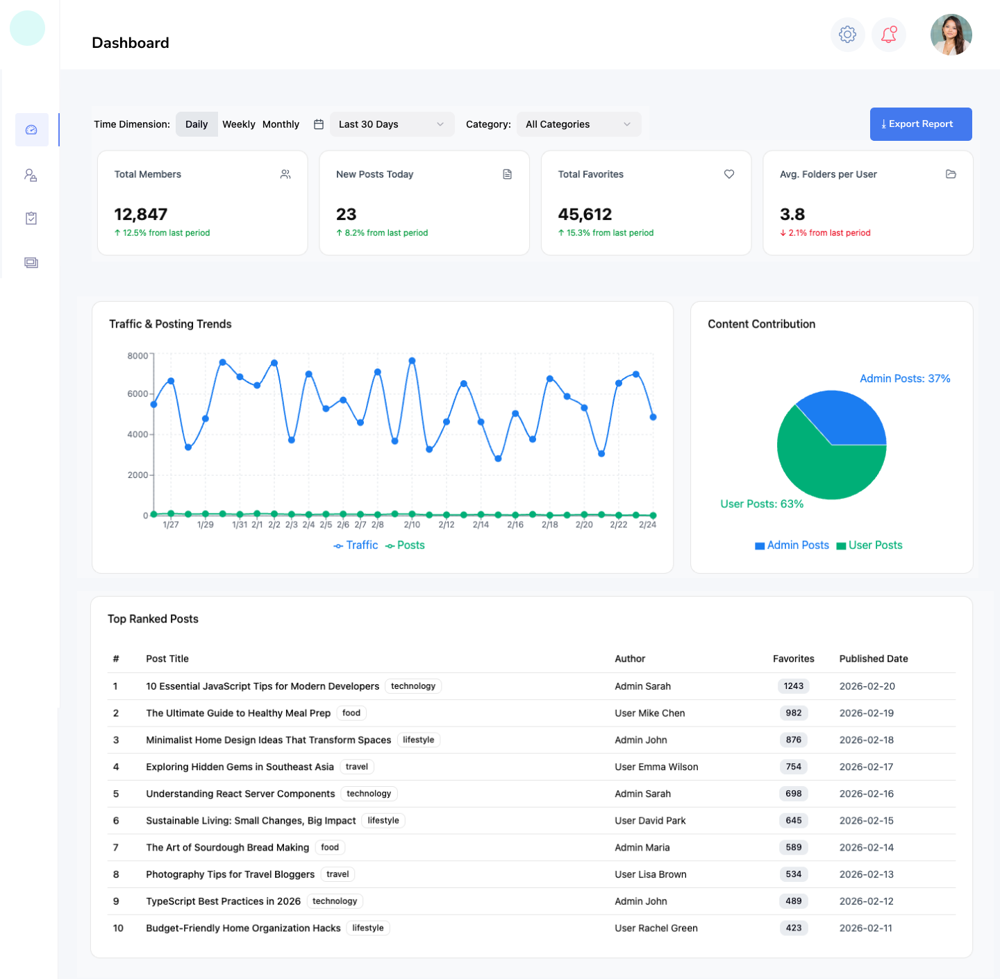

# UWow Frontend

這是一個使用 Vue 3 + TypeScript + Vite 建立的專案。

## 啟動專案

```bash
npm install
npm run dev
```

---

## API 參考文檔

> 以下為後端 API 的簡易參考規格。

### 資料模型 (Data Models)

#### User

```typescript
interface User {
  id: number;
  username: string;
  position: string;
  location: string;
  age: number;
  birthdate: string; // 格式: "YYYY-MM-DD"
  is_pinned: boolean;
  pin_order: number | null; // null 代表未釘選
  created_at: string; // ISO 8601
  updated_at: string; // ISO 8601
}
```

#### UserPayload (新增/更新用請求主體)

```typescript
type UserPayload = {
  username: string;
  position: string;
  location: string;
  age: number;
  birthdate: string;
};
```

---

### API Endpoints 總覽

| Method   | URL                       | 功能說明           |
| -------- | ------------------------- | ------------------ |
| `GET`    | `/api/users`              | 取得分頁與釘選列表 |
| `POST`   | `/api/users`              | 新增使用者         |
| `PATCH`  | `/api/users/:id`          | 更新單筆使用者     |
| `DELETE` | `/api/users/:id`          | 刪除單筆使用者     |
| `POST`   | `/api/users/:id/pin`      | 釘選 (Pin)         |
| `DELETE` | `/api/users/:id/pin`      | 取消釘選 (Unpin)   |
| `POST`   | `/api/users/reorder-pins` | 重排釘選順序       |

---

### API 詳細說明

#### 1. 取得使用者 `GET /api/users`

- **Query Params**: `search`, `sort_by` (欄位名稱), `sort_dir` (asc/desc), `page` (預設 1), `per_page` (預設 50)
- **Response**:

```json
{
  "pinned": [{ "id": 3, "is_pinned": true, "pin_order": 1 }],
  "data": [{ "id": 1, "is_pinned": false }],
  "page": 1,
  "total_pages": 10,
  "total": 498
}
```

#### 2. 新增使用者 `POST /api/users`

- **Body**: `UserPayload`
- **Response (201)**: 回傳包含 ID 與時間的完整 `User` 物件。

#### 3. 更新使用者 `PATCH /api/users/:id`

- **Body**: `Partial<UserPayload>` (只需傳入要修改的欄位)
- **Response (200)**: 回傳更新後的完整 `User` 物件。

#### 4. 刪除使用者 `DELETE /api/users/:id`

- **Response (204)**: 成功且無回傳內容。

#### 5. 釘選使用者 `POST /api/users/:id/pin`

- **Response (200)**: 回傳該名 user 以及更新的 pinned 陣列。

```json
{
  "user": { "id": 5, "is_pinned": true, "pin_order": 4 },
  "pinned": [{ "id": 3 }, { "id": 5 }]
}
```

#### 6. 取消釘選使用者 `DELETE /api/users/:id/pin`

- **Response (200)**: 回傳該名 user 以及更新順序後的 pinned 陣列。

#### 7. 重排釘選順序 `POST /api/users/reorder-pins`

- **Body**:

```json
{
  "ids": [7, 3, 5, 2]
}
```

- **Response (200)**:

```json
{
  "pinned": [
    { "id": 7, "pin_order": 1 },
    { "id": 3, "pin_order": 2 }
  ]
}
```

---

### 統一錯誤回應格式 (422 範例)

```json
{
  "message": "Validation failed",
  "errors": {
    "username": ["欄位不可為空", "最多 50 個字元"]
  }
}
```

---

## 問題回答

### Q1b: 關於 Vue3 的經驗分享、優點與缺點

以我過去使用 Vue3 的經驗來說，我其實滿喜歡它的 Composition API 跟 Proxy 的響應式系統。像我之前開發會員系統時，包含防止折價券被詐領，還有跨裝置驗證碼這類比較複雜的流程，Composition API 讓我可以把商業邏輯拆得很乾淨，也比較好維護。而且不像 React，有時候要一直注意 useEffect 的依賴問題，Vue 在這方面開發體驗比較直覺。

另外 Vue 的官方生態系也很完整，像 Pinia 這類狀態管理工具都有很標準的做法，對團隊來說比較容易建立一致的開發模式，也有助於快速交付產品。不過在更深入開發之後，我也慢慢發現它的一些限制。當產品開始比較重視 SEO、SSR 效能，或是需要整合一些新的 AI API 時，我發現 React 生態系，尤其是 Next.js，整體的解決方案和社群資源都更成熟，也更完整。

所以在我後來開發個人專案時，我主動選擇轉到 React 和 Next.js。實際轉過去之後，效果也很明顯。透過 Next.js 的架構優化，我成功把 Core Web Vitals 裡的 CLS 降到 0.003，同時搭配 SEO 策略，讓網站流量在三個月內成長超過 70 倍。總結來說，我認為 Vue3 非常適合需要快速開發、穩定交付的產品；但如果產品目標是高度 SEO 成長，或需要整合比較前沿的技術，React 和 Next.js 生態系會更有優勢。而我自己的 AI 背景，讓我習慣用數據去分析問題、驗證結果。所以我不會特別侷限在某個框架，而是會根據產品的目標，選擇最適合的技術。

### Q2

**情境一：用戶增長至 5 萬人，僅 1-2 天優化空間**

- **快取：** 將最熱門的搜尋結果或分頁前幾頁存入 Redis，存活時間拉長。
- **限流：** 限制單一用戶每秒請求數，檢查前端是否有不必要的重複 Request，或者針對搜尋框加上更嚴格的 Debounce。
- **選擇原因：** 我會選擇CDN 快取策略 + API 防抖，只需修改配置或幾行程式碼即可上線，風險低、回報高。

**情境二：無限滾動導致 RAM 佔用過高**

- **解決方案：** 虛擬列表 (Virtual List / Virtual Scrolling)。
- **作法：** 只渲染用戶當前看得到的那 10-20 筆 DOM 節點。當用戶向下捲動時，動態替換內容並移動節點位置，而不是一直往下方增加節點。
- **工具：** 可以使用 `vue-virtual-scroller` 或自行實作 Intersection Observer 邏輯。
- **效果：** 無論有一萬筆還是一百萬筆數據，瀏覽器渲染的 DOM 數量始終固定，RAM 佔用會保持在極低水平。

## Q3

### Dashboard

老闆不需要處理單篇文章或單個用戶的瑣事，他需要的是大方向。透過成長曲線與比例圓餅圖，他能快速判斷網站是否在成長。設計熱門排行榜是為了讓他掌握網站的內容價值，作為未來商業擴張或廣告投放的依據。



### User Management

將名單結合統計卡片與操作按鈕。讓管理員能一眼看出異常（如停權數激增），並直接在表格內執行「停權」或「更動」，提高處理違規或客訴的效率。


### User Favorites Management

這張圖彌補了單純文章審核的不足，用戶建立的資料夾名稱是網站中潛在的隱形違規區。設計資料夾表單是為了確保網站秩序。


### Q5: QPS 從 300 暴增至 3,000 的「止血」方案

1. **靜態資源分流與防抖：** 把 Vue3 的 JS、CSS、圖片這些靜態檔案全部交給 CloudFront 或 Akamai 處理，讓使用者直接從最近的節點載入，而不是每次都打到主伺服器。同時調整 `Cache-Control`，讓瀏覽器可以優先用本地快取，減少不必要的請求。檢查所有搜尋框、分頁按鈕和送出按鈕，加上 `debounce` 或 `throttle`，避免使用者短時間內連續點擊，產生一堆重複且沒必要的 API 請求。
2. **優先讀取本地快取：** 透過 PWA 的 Service Worker，把像產品列表這類不會頻繁變動的 API 回應暫時存在本地。這樣使用者短時間內再次開啟時，可以直接用本地資料，速度更快，也減少後端壓力。
3. **流量削峰：** 如果是活動或瞬間流量暴增的情況，可以在前端加一個簡單的排隊頁，或隨機延遲幾百毫秒再發送請求，避免所有請求同時打進來，把系統壓垮。
4. **功能降級：** 如果系統還是撐不住，可以先暫時關閉一些非必要功能，例如搜尋或即時統計圖表，優先確保最重要的功能（像是讀取文章、註冊和登入）可以正常使用。
